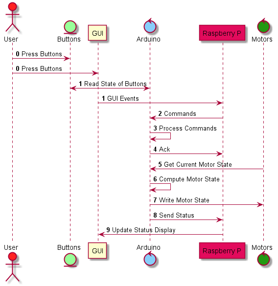

============================
RObh.aT Dome Project Summary
============================

    
| The chart above shows how the different hardware and software components communicate to facilitate the safe
 control of the motors. The code represented by the chart is run approximately once per second,
 but can be made to run arbitrarily fast. Limitations for arbitrary speed execution include the baud 
 rate of the serial ports of the Raspberry Pi and Arduino, the clock frequencies of the Pi and Arduino,
 and the switching speed of the relays.
| The goal of the **RObh.aT Netowork -- Dome Automation** project is to create an Open-Source Hardware motor controller box for small to mid-sized universities. 